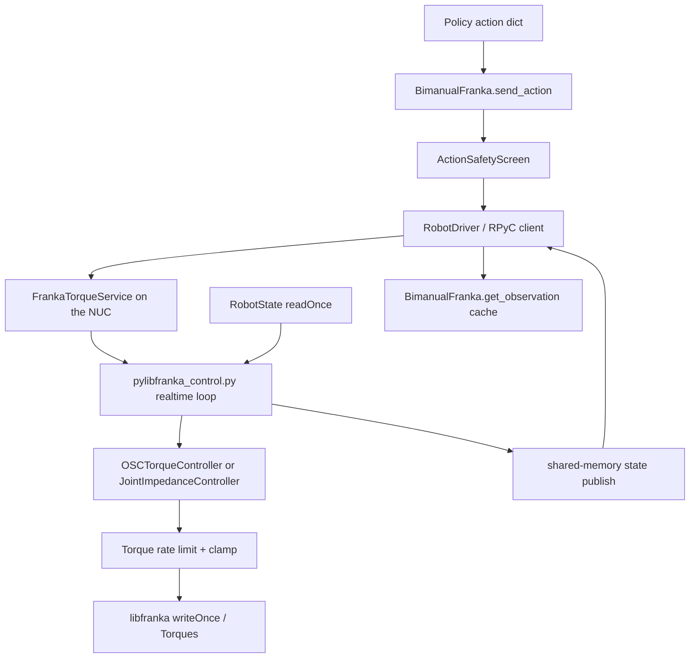

# OSC Torque Control Stack

This document traces the full path from a policy action to the torques written to libfranka. It covers the robot-side dispatch, the RPyC/shared-memory transport, the NUC-side realtime loop, the OSC math itself, and the safety and recovery logic that sits around it.

The core design choice is simple: the workstation sets goals at policy rate, while the NUC recomputes torques continuously from those goals. The robot never receives a precomputed torque trajectory from the workstation.

## Topology

The important split is between goal setting and torque computation:

- `BimanualFranka` decides which control mode to use and turns the action into a goal.
- `pylibfranka_server.py` owns the robot session and the shared-memory channel.
- `pylibfranka_control.py` owns the realtime loop and computes the actual torques.

## The Action That Comes In

The robot wrapper exposes three action modes through `BimanualFranka`:

- `EE_DELTA`: action is a per-step Cartesian delta pose.
- `EE_POS`: action is an absolute end-effector pose.
- `JOINT_POS`: action is a 7-joint position target.

Every action also carries `kp` and `kd` gain channels. Those are not direct gains; they are exponentiated into the sim-parity gain range before being sent to the NUC.

The robot-side entry point is [BimanualFranka.send_action](lerobot_robot_bimanual_franka/lerobot_robot_bimanual_franka/bimanual_franka.py). It does four things in order:

1. Reuses the cached kinematic snapshot from `get_observation()` when it is still fresh.
2. Converts the action gains into OSC gain vectors with `resolve_gains()` or joint impedance scalars.
3. Runs the action through `ActionSafetyScreen`.
4. Sends the resulting goal to the NUC through `RobotDriver`.

## Robot-Side Dispatch

### Cached state first

`get_observation()` reads the latest kinematic state from the NUC and caches it. `send_action()` reuses that snapshot if it is younger than `_KIN_CACHE_MAX_AGE_S`, which keeps the goal anchored on the pose the policy actually observed instead of paying another RPyC round trip.

For `EE_DELTA`, this matters because the new goal is rebuilt from the measured pose every step. A stale anchor would silently subtract motion the arm already made.

### Gain remapping

The `kp` and `kd` channels are mapped with the same exponential schedule used by the sim wrapper:

- `kp` becomes a stiffness multiplier over the baseline OSC gain.
- `kd` becomes a damping-ratio multiplier.

In OSC mode, `resolve_gains()` expands those scalars into 6-vectors so the position and orientation blocks can be tuned separately. Optional per-axis scales from the config can further trim position or orientation stiffness/damping.

### The three control modes

#### `EE_DELTA`

This is the path used by the delta-action policies. The action already contains a Cartesian delta in workspace units, so `BimanualFranka._osc_goal_delta()` does not accumulate onto a previous goal. Instead, it:

- extracts the position delta from the action,
- converts the delta quaternion to an axis-angle rotation vector,
- adds any cached residual offset from `cache_delta()`,
- optionally adds noise if the config requests it,
- clips to the policy envelope with `clip_delta()`,
- applies any configured translation/rotation fudge, and
- updates the persistent orientation goal only when the rotation delta is nonzero.

That last point is load-bearing: pure translation commands must keep the current orientation alive, otherwise the arm tumbles while moving.

#### `EE_POS`

This mode interprets the action as an absolute pose. `BimanualFranka._osc_goal_absolute()` converts the pose directly into an OSC goal, optionally ignoring the action and parking on the current pose when `ignore_action=True`.

The same cached residual delta offsets from `cache_delta()` are applied here too.

#### `JOINT_POS`

This mode sends a joint position target to the server, unscreened: the worktable floor bounds an EE goal pose and a joint-position command has none. The NUC then runs a joint impedance controller instead of OSC.

### Safety before dispatch

All three modes are screened by `ActionSafetyScreen` before being sent.

- `shape_goal()` is the only screen, and applies to the OSC modes. It raises the goal along world-up until the EE collision sphere clears the worktable floor. There is no descent envelope, no joint-space form, and no velocity-domain form: it is a pure position clamp, independent of `kp`/`kd`.

The screen is pure: it transforms `(action, kin_state)` into a safer action without side effects.

## Transport Layer

The workstation and the NUC do not share a process. They communicate in two steps:

1. `RobotDriver` opens an RPyC connection to the server and asks it to start the control process for a given robot IP.
2. The server and the control loop exchange goals and state through a single shared-memory block.

The client-side wrapper is [franka_process.py](lerobot_robot_bimanual_franka/lerobot_robot_bimanual_franka/franka_process.py).

### Why the split exists

The torque loop cannot live in the same Python process as the RPyC server. Protocol handling is too slow and too GIL-heavy for a 1 kHz tick budget. The shared-memory split avoids that starvation.

### Shared-memory layout

The layout is defined in [pylibfranka_shm.py](lerobot_robot_bimanual_franka/lerobot_robot_bimanual_franka/pylibfranka_shm.py).

- The goal block is written by the server and read by the control loop.
- The state block is written by the control loop and read by the server.
- Each block has a seqlock counter, so torn reads are detected instead of blocking.

The goal block holds:

- control mode,
- a monotonically increasing command sequence,
- OSC goal position and quaternion,
- OSC `kp` and `kd` vectors,
- nullspace reference,
- joint targets and joint gains,
- friction and damping tuning knobs,
- uncoupling flag, and
- a running flag.

The state block holds:

- joint position and velocity,
- end-effector position, orientation, and twist,
- recovery count,
- commanded / measured / external-estimate torques,
- control-command success rate,
- guard trip count,
- alive flag, and
- a state sequence number.

### RPyC client behavior

`RobotDriver` only ships goals and reads the latest published state. It does not own any realtime robot handle. Its methods are intentionally non-blocking from the robot's point of view:

- `send_osc_goal()` packs a single flat tuple for the OSC goal.
- `send_joint_goal()` and `send_joint_velocity()` write the joint targets.
- `get_kinematic_state()` reads the latest state bundle and reconstructs the Jacobian locally from the measured pose.

That reconstruction is important because the Jacobian is not sent over the wire.

## NUC-Side Server

The server is [pylibfranka_server.py](lerobot_robot_bimanual_franka/lerobot_robot_bimanual_franka/pylibfranka_server.py). It runs on the NUC and owns only the shared-memory channel and the control process lifecycle.

Each robot IP gets one `_ArmSession`. That session:

- creates the shared-memory block,
- spawns `pylibfranka_control.py` under `taskset` and `chrt -f 80`,
- waits for the control process to publish `S_ALIVE = 1`, and
- exposes the goal setters and state getters over RPyC.

The server also keeps the `SlaveService` base class, because the gripper client expects classic RPyC behavior on the same port.

## Realtime Control Loop

The control loop is [pylibfranka_control.py](lerobot_robot_bimanual_franka/lerobot_robot_bimanual_franka/pylibfranka_control.py).

This is the code that actually talks to libfranka. It runs the realtime `readOnce()` / `writeOnce()` cycle and computes torques from the latest goal and state.

### Timing model

The loop is pipelined:

1. Read the robot state.
2. Write the torque prepared on the previous tick.
3. Compute the next torque in the slack that remains before the next state.

That ordering is intentional. Writing first keeps the response path short enough to stay within the realtime budget.

The control law itself is recomputed every other tick (`_CONTROL_DECIMATION = 2`). That matches the sim’s 500 Hz controller cadence more closely than recomputing at the full 1 kHz loop rate. `_enforce_limits` and the write still run every tick.

### Process setup

The loop also does a few things up front to reduce latency jitter:

- pins BLAS thread pools to one thread,
- tries to run under `SCHED_FIFO 80`,
- disables the GC, and
- freezes cyclic GC state so it does not wake up inside the realtime loop.

### Arming and recovery

The loop calls `start_torque_control()` on the robot and retries arming a few times if the robot is still recovering from a previous session or throws a recoverable fault.

If a recoverable error occurs during the loop, it calls `automatic_error_recovery()`, drops back to the unarmed state, and tries again. The control loop also marks the session stale if no new goal arrives for too long and falls back to a hold mode.

### The per-tick flow

At each tick the loop does:

1. Read the robot state.
2. If there is no cached raw torque yet, compute one from the current goal.
3. Apply `_enforce_limits` to the torque prepared on the previous tick.
4. Apply the torque-rate limiter against `state.tau_J_d`.
5. Write the resulting torques.
6. Compute the next raw torque during slack time if this is a control-law tick.
7. Publish state to shared memory every few ticks.

## OSC Torque Computation

The OSC implementation lives in [osc_torque_controller.py](lerobot_robot_bimanual_franka/lerobot_robot_bimanual_franka/osc_torque_controller.py).

It is a torque-domain port of robosuite’s `OperationalSpaceController` in `impedance_mode="variable"`.

### Goal setting

The workstation pushes a goal pose and gain vector with `set_osc_goal`. The controller stores:

- the goal position,
- the goal orientation matrix,
- the 6-axis `kp` vector,
- the 6-axis `kd` vector, and
- the initial joint configuration used for nullspace attraction.

`reset_goal()` simply parks the goal on the current EE pose.

### Error terms

On each control tick, `run_controller()` computes:

- Cartesian position error,
- Cartesian velocity error,
- orientation error using robosuite’s cross-product formulation,
- orientation velocity error.

Those are combined into a desired force and a desired torque.

### Operational-space mapping

`opspace_matrices()` builds the operational-space inertia matrices and the nullspace projector from the mass matrix and Jacobian.

Two details matter here:

The wrench is always the **coupled** `lambda_full @ [force, torque]`, i.e. osc.py's `uncouple_pos_ori=False`. It is baked into `OSCTorqueController` -- no flag, no config key, no constructor argument -- and `test_coupled_wrench_is_baked_in_and_matches_robosuite` asserts it stays that way.

osc_pose.json sets `True`, which applies `lambda_pos`/`lambda_ori` to the two halves separately: it sizes the translation force as if rotation were free and scales the moment by the ~0.002 kg m^2 wrist inertia, which left joint 4 at 0.25x breakaway on +X and put orientation commands under breakaway friction. The coupled form is the exact operational-space solution: response is the commanded acceleration, cross-coupling is zero, and X went from 43-71% to ~100% of command, pose-independently.

Two modifications come with it, both baked in and both inseparable from the choice:

1. **`lambda_full` is damped** by `LAMBDA_DLS_MU` (0.025). The coupled form inverts a 6x6 whose condition number runs 6.4e3 at the home pose and 1.2e7 as joint 4 extends; undamped, a full 5 cm delta at that reach commanded 156 Nm against an 87 Nm clamp, and a saturated clamp is maximum-force motion, which the robot reports as `cartesian_reflex`. At 0.025 the same pose asks 22.5 Nm and the home pose moves 18.6 -> 18.4 Nm.
2. **The orientation->force block is dropped** (`lambda_full[:3, 3:]`). That block is the force which cancels the linear acceleration a pure moment implies -- correct only if the moment is actually delivered. Under breakaway friction the wrist stalls while the proximal joints deliver the compensating force in full, so what survives is a standing push: 9.1 N for a 0.05 rad residual at the home pose, 5.7x the force a 1 mm position error makes. Nothing opposes it, because EE_DELTA rebuilds `goal_pos` from the measured pose every step and no position error ever accumulates, so the arm settles into a ~5.7 cm/s drift at rest.

Both are asserted behaviourally in `tests/test_osc_stack.py` (`test_dls_bounds_lambda_full_near_a_singularity`, `test_pure_orientation_error_produces_no_translational_wrench`) rather than by transcription, and the parity harnesses apply the same two modifications to their robosuite reference so a *third* divergence still fails them.

Watch `clamp_trips` in the NUC health log: it is the signal that a gain is out of range for the pose.

The final task wrench is then projected back to joint torques with `J^T`.

### Gravity and coriolis

The hardware path adds coriolis compensation only. libfranka already handles gravity internally, so adding full bias compensation would be wrong on this stack.

### Nullspace control

The OSC controller adds nullspace torques so the arm is gently attracted toward its initial joint configuration while executing the task. That reference is seeded on connect and refreshed after homing.

### Friction assist

An optional Coulomb friction feedforward term is added only in OSC mode. It is meant to help break static friction on the real arm; it is not part of sim parity.

## Joint Impedance Path

`JOINT_POS` and homing do not use OSC. They use [JointImpedanceController](lerobot_robot_bimanual_franka/lerobot_robot_bimanual_franka/osc_torque_controller.py).

There are two subcases:

- Position hold uses joint-space PD with the mass-matrix-independent stiffness vector and damping capped against the live inertia.
- Joint-velocity mode weights the velocity error through the mass matrix instead.

This path exists because OSC is not the right tool for directly converging to a joint configuration. Homing uses this controller specifically so the arm can approach a saved configuration safely and repeatably.

## Safety and Limits in the NUC Loop

The control loop has a second layer of protection beyond the robot-side safety screen.

### Torque limits

`_enforce_limits` is the only bound on what reaches the joints: rate-limit against `state.tau_J_d` at `max_torque_rate_nm_s`, then clamp to the datasheet `joint_torque_nm`. There is no velocity guard. A law that asks past the clamp reads as a saturated joint (`clamp_trips` in the health log), not as a silently rescaled control law.

This guard is intentionally inside the realtime loop because it bounds what actually reaches the joints.

### Torque-rate limit

The torque rate limiter caps the step in commanded torque between ticks. This is mandatory because libfranka rejects abrupt jumps beyond its allowed rate.

### Stale goal handling

If the goal goes stale for long enough, the loop switches to a hold state so the arm stays where it is instead of continuing to act on an outdated command.

## State Flow Back to the Workstation

The control loop publishes state into shared memory. `RobotDriver.get_kinematic_state()` reads that block and returns a tuple containing:

- joint positions,
- joint velocities,
- Jacobian,
- end-effector position,
- end-effector quaternion, and
- end-effector twist.

`BimanualFranka.get_observation()` uses that to build the observation dict, cache the kin snapshot, and expose the latest torques and recovery metadata.

## How the Main Paths Turn Actions Into Torques

### `EE_DELTA`

1. Policy emits delta pose and gains.
2. `BimanualFranka` rebuilds an absolute goal from the current pose plus the delta.
3. Safety clamps the goal against the table and the delta envelope.
4. The server stores the goal in shared memory.
5. The control loop converts goal error and velocity into wrench.
6. OSC maps wrench to joint torques.
7. `_enforce_limits` rate-limits and clamps the final torque.
8. `writeOnce(Torques)` sends the torques to libfranka.

### `EE_POS`

Same as above, except the action already carries the absolute pose instead of a delta. The rest of the chain is identical.

### `JOINT_POS`

1. Policy emits joint targets and gains.
2. `BimanualFranka` shapes the target for table safety.
3. The server stores a joint-goal block.
4. The control loop runs joint impedance instead of OSC.
5. The same `_enforce_limits` still applies.
6. Torques are written to libfranka.

## Validation Scripts

The most relevant sanity checks are:

- [scripts/check_osc_parity.py](scripts/check_osc_parity.py) for numeric parity against robosuite’s controller.
- [scripts/check_osc_e2e.py](scripts/check_osc_e2e.py) for the end-to-end goal-to-torque path.
- [scripts/check_osc_axes.py](scripts/check_osc_axes.py) for per-axis physical response.

## Reading Order

If you want to inspect the stack in source order, start here:

1. [bimanual_franka.py](lerobot_robot_bimanual_franka/lerobot_robot_bimanual_franka/bimanual_franka.py)
2. [safety.py](lerobot_robot_bimanual_franka/lerobot_robot_bimanual_franka/safety.py)
3. [franka_process.py](lerobot_robot_bimanual_franka/lerobot_robot_bimanual_franka/franka_process.py)
4. [pylibfranka_server.py](lerobot_robot_bimanual_franka/lerobot_robot_bimanual_franka/pylibfranka_server.py)
5. [pylibfranka_control.py](lerobot_robot_bimanual_franka/lerobot_robot_bimanual_franka/pylibfranka_control.py)
6. [osc_torque_controller.py](lerobot_robot_bimanual_franka/lerobot_robot_bimanual_franka/osc_torque_controller.py)

That order follows the actual command path from policy code to torques.